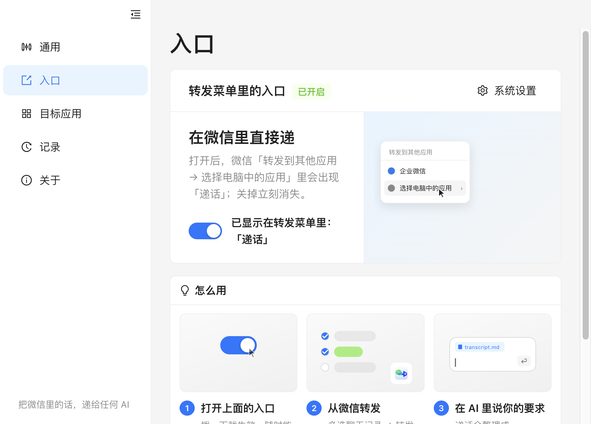
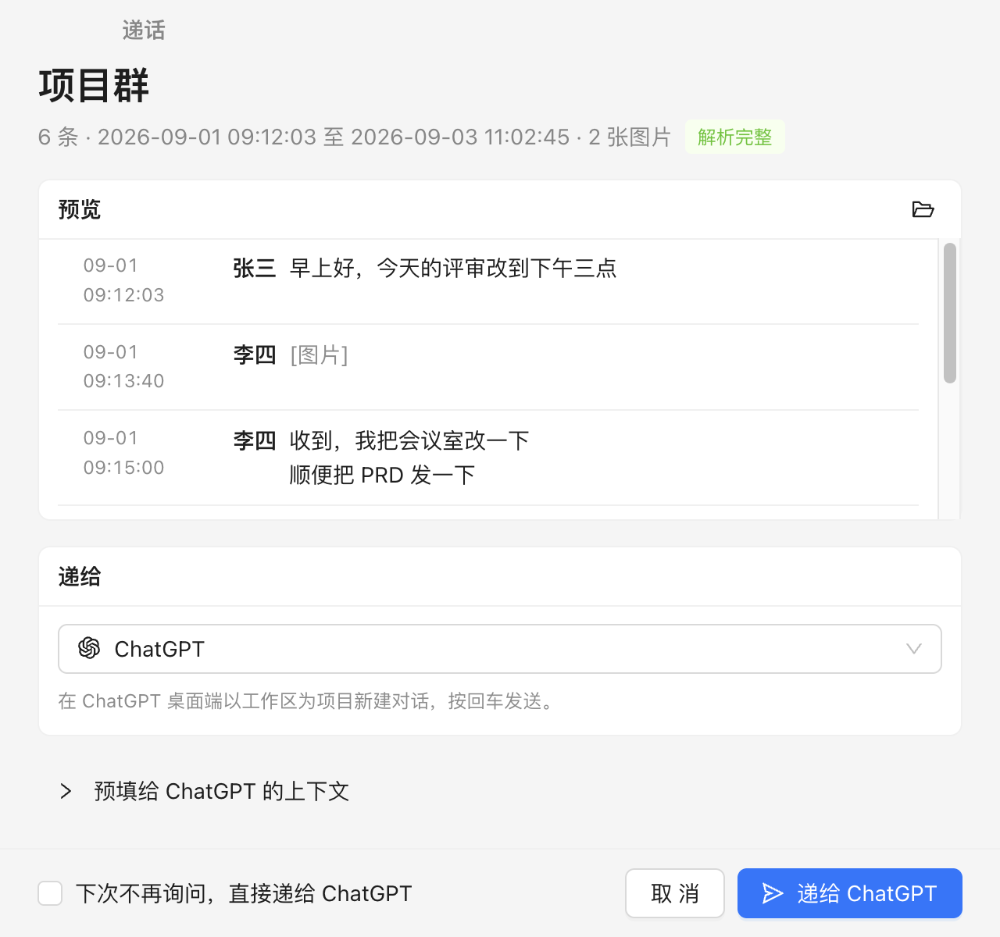
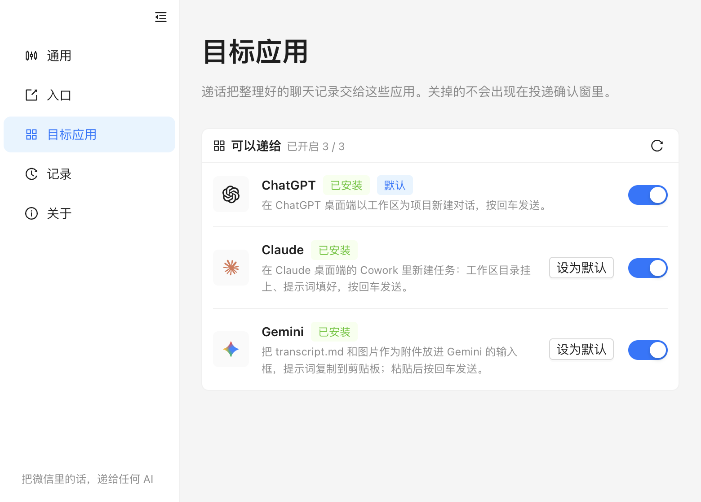
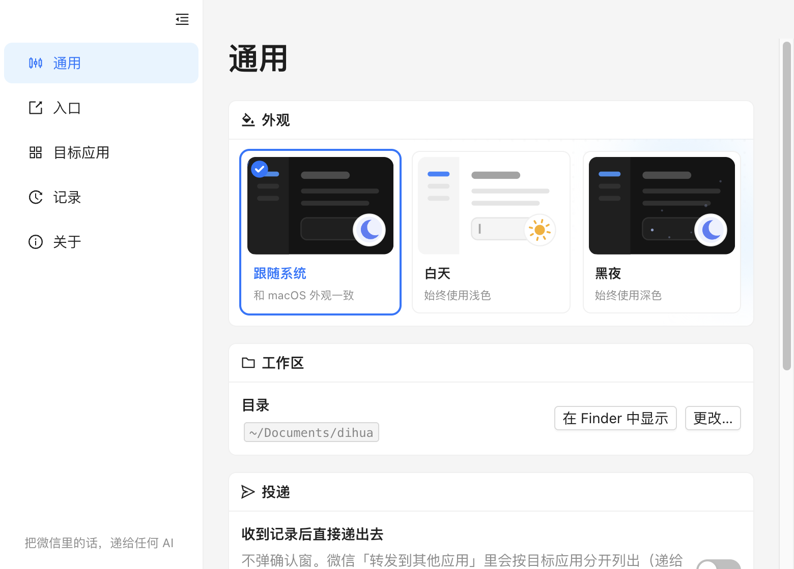
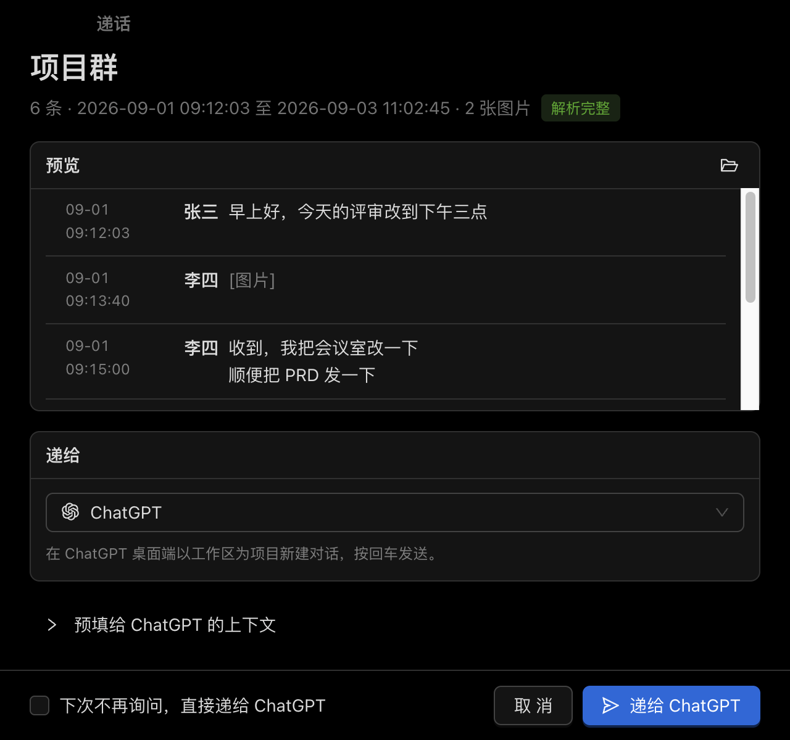

<p align="center">
  
</p>

<h1 align="center">递话 · Dihua</h1>

<p align="center">
  <b>把微信里的话，递给任何 AI。</b><br>
  在 Mac 微信里多选消息、转发给递话，聊天记录连同图片、文件和一句现成的提示词，直接落进 ChatGPT、Claude 或 Gemini。
</p>

<p align="center">
  <a href="README.md">English</a> · <b>简体中文</b>
</p>

<p align="center">
  <a href="https://github.com/ZHlovecat/dihua/releases"></a>
  <a href="https://github.com/ZHlovecat/dihua/actions/workflows/ci.yml"></a>
  
  <a href="LICENSE"></a>
</p>

<p align="center">
  
</p>

## 为什么要有递话

Mac 微信 4.1.13 起，多选消息可以「转发到其他应用」，导出成一个 zip——但那个菜单里只认腾讯自家的应用。递话在里面放了一个真正能用的入口：选好消息、转发，下一秒你常用的 AI 桌面端就打开了，整段对话已经摆在它面前。

- **一个动作。** 多选 → 转发 → 转发到其他应用 → 递话，完事。
- **AI 真的读得到。** zip 被整理成一个干净的工作区：`transcript.md`（按时间排好、标注发言人）、图片和视频、`meta.json`。每个目标应用按它最能消化的方式接收。
- **要做什么由你说。** 递话只预填「记录在哪、是什么」；总结、提待办、翻译……到 AI 里说一句，回车。
- **不经递话上传任何东西。** 没有账号、没有服务器、没有埋点。AI 应用照旧和它们自己的后台通信。

## 怎么用

<p align="center">
  
</p>

1. **打开入口。** 递话注册了一个 macOS 共享扩展，微信「转发 → 转发到其他应用 → 选择电脑中的应用」里就会列出它。
2. **从微信转发。** 多选任意消息——文字、图片、视频、文件——转发给「递话」。
3. **说你的要求。** 递话打开目标应用，记录已附上、提示词已填好，接着说你要做什么，回车。

<p align="center">
  
</p>

想一步到位？打开「收到记录后直接递出去」，转发菜单里会按目标分开列出「递给 ChatGPT」「递给 Claude」「递给 Gemini」，点哪个直接递给哪个，中间不弹确认窗。

## 支持的目标应用

| 目标 | 记录怎么到它手里 |
|---|---|
| **ChatGPT 桌面端（Codex）** | 以递话工作区为项目新建对话，提示词预填好；Codex 自己去读 `transcript.md` 和图片。 |
| **Claude 桌面端（Cowork）** | 新建一个 Cowork 任务，工作区目录挂上、提示词预填好。 |
| **Gemini 桌面端** | 把 `transcript.md` 和最多 9 个图片/文件作为附件放进输入框，提示词复制到剪贴板，粘贴即发。 |

<p align="center">
  
</p>

接更多目标（Cursor、Kimi、元宝……）只需要写一个很小的适配器，见 [docs](docs/)。

## 安装

1. 到 [Releases](https://github.com/ZHlovecat/dihua/releases) 下载对应架构的 dmg——Apple Silicon 选 `arm64`，Intel 选 `x64`——拖进「应用程序」。
2. 安装包是 ad-hoc 签名、未公证。首次打开若被拦，右键 *Dihua.app → 打开*，或执行：
   ```bash
   xattr -d com.apple.quarantine /Applications/Dihua.app
   ```
3. 启动一次递话，它会自动登记共享入口；微信菜单里若还没出现，到「系统设置 → 通用 → 登录项与扩展 → 扩展 → 共享」里打开「递话」。

**要求：** macOS 13 Ventura 及以上 · Mac 微信 4.1.13 及以上 · ChatGPT / Claude / Gemini 桌面端至少装一个。

**更新：** 「关于 → 检查更新」读取 GitHub Releases 并给出下载链接；启动时每天最多自动查一次，有新版本会通知你。

## 磁盘上有什么

```
~/Documents/dihua/
└── inbox/20260907-231000-项目群/
    ├── transcript.md     # 按时间排序、标注发言人、图片已链接
    ├── meta.json         # 条数、时间范围、解析置信度
    ├── 媒体/             # 图片与视频（视频另有 .thumb.png 缩略图）
    └── 原始/             # 微信导出的原始 zip 与 txt
```

每条记录都列在递话的「记录」里，可以再递一次、在 Finder 中显示、或连文件一起删除；自动清理时长可设。

<p align="center">
  
  <br>
  
</p>

## 开发

```bash
pnpm install        # Node 22+，pnpm 10
pnpm dev            # electron-vite 开发模式
pnpm test           # vitest
pnpm install:mac    # 编译共享扩展 → 打包 → ad-hoc 签名 → 装进 /Applications
```

Electron 44 · React 19 · Ant Design 6 · 用 `clang` 直接编译的 Objective-C 共享扩展（不需要 Xcode）。细节见 [docs/开发.md](docs/开发.md)，调研与设计见 [docs/调研与技术方案.md](docs/调研与技术方案.md)。

发布由 GitHub Actions 完成：推一个与 `package.json` 版本一致的 `v*` 标签，工作流会打出两种架构的 dmg / zip 并挂到 Release。

## 路线图

- 更多目标：Cursor、Kimi、元宝、Claude Code
- 英文界面（目前应用界面为简体中文）
- 正式签名与公证
- Windows（Windows 微信有同样的转发功能）

## 许可

[MIT](LICENSE) © 2026 zhanghang
